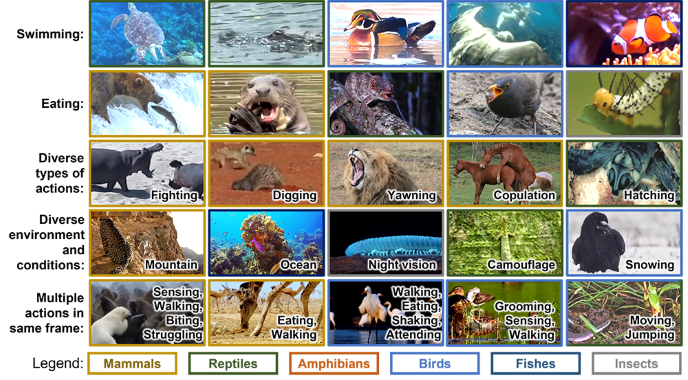
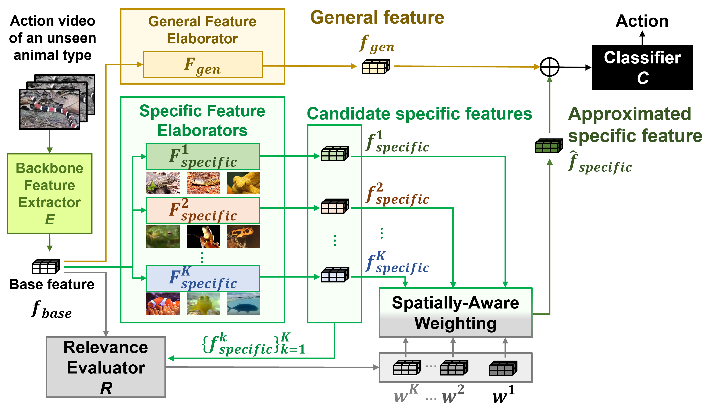
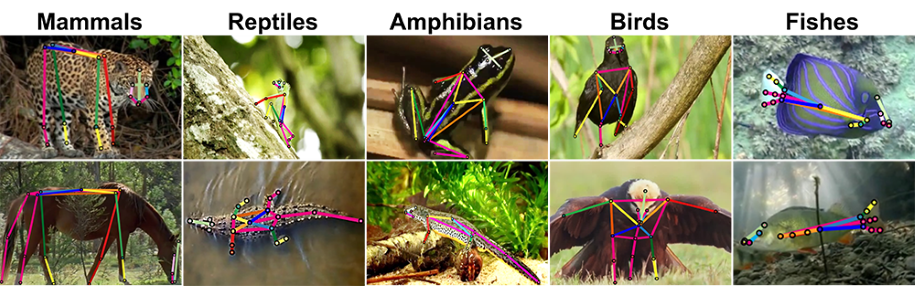
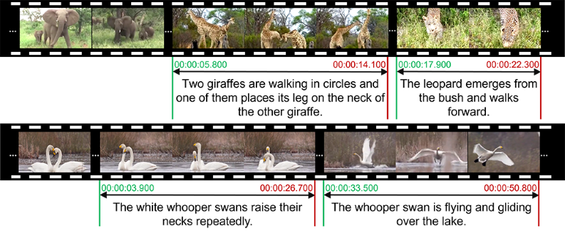

# [Animal Kingdom Dataset](https://sutdcv.github.io/Animal-Kingdom)


<!--  -->
This is the official repository for <br/>**[[CVPR2022] Animal Kingdom: A Large and Diverse Dataset for Animal Behavior Understanding](https://openaccess.thecvf.com/content/CVPR2022/html/Ng_Animal_Kingdom_A_Large_and_Diverse_Dataset_for_Animal_Behavior_CVPR_2022_paper.html)**
<br/>**Xun Long NG, Kian Eng ONG, Qichen ZHENG, Yun NI, Si Yong YEO, Jun LIU**
<br/>*Information Systems Technology and Design, Singapore University of Technology and Design, Singapore*

# [Dataset and Codes](https://forms.office.com/r/WCtC0FRWpA)
**[Download dataset and codes here](https://forms.office.com/r/WCtC0FRWpA)**

**NOTE: The codes of the models for all tasks have been released. Codes are included in the folder of the dataset. After you download our dataset, you can find the corresponding codes for each task. Helper scripts are provided to automatically set up the environment to directly run our dataset. The [Animal_Kingdom](Animal_Kingdom) GitHub codes are the same as the codes in the download version, hence there is no need to download the GitHub codes.**


## README
Please read the respective README files in [Animal_Kingdom](Animal_Kingdom) for more information about preparing the dataset for the respective tasks.
* [Overview of dataset](Animal_Kingdom/README.md)
* [Meta-data: 140 Action Description, List of >850 animals and classification](Animal_Kingdom/action_recognition/AR_metadata.xlsx)
* [Action Recognition](Animal_Kingdom/action_recognition/README_action_recognition.md)
* [Pose Estimation](Animal_Kingdom/pose_estimation/README_pose_estimation.md)
* [Video Grounding](Animal_Kingdom/video_grounding/README_video_grounding.md)


# Paper
* [CVPR2022](https://openaccess.thecvf.com/content/CVPR2022/html/Ng_Animal_Kingdom_A_Large_and_Diverse_Dataset_for_Animal_Behavior_CVPR_2022_paper.html)
* [ResearchGate](https://www.researchgate.net/publication/359816954_Animal_Kingdom_A_Large_and_Diverse_Dataset_for_Animal_Behavior_Understanding)
* [arXiv](https://arxiv.org/abs/2204.08129)

## Citation
```BibTeX
@InProceedings{
    Ng_2022_CVPR,
    author    = {Ng, Xun Long and Ong, Kian Eng and Zheng, Qichen and Ni, Yun and Yeo, Si Yong and Liu, Jun},
    title     = {Animal Kingdom: A Large and Diverse Dataset for Animal Behavior Understanding},
    booktitle = {Proceedings of the IEEE/CVF Conference on Computer Vision and Pattern Recognition (CVPR)},
    month     = {June},
    year      = {2022},
    pages     = {19023-19034}
 }
 ```

## Abstract
Understanding animals' behaviors is significant for a wide range of applications. However, existing animal behavior datasets have limitations in multiple aspects, including limited numbers of animal classes, data samples and provided tasks, and also limited variations in environmental conditions and viewpoints. To address these limitations, we create a large and diverse dataset, Animal Kingdom, that provides multiple annotated tasks to enable a more thorough understanding of natural animal behaviors. The wild animal footages used in our dataset record different times of the day in extensive range of environments containing variations in backgrounds, viewpoints, illumination and weather conditions. More specifically, our dataset contains 50 hours of annotated videos to localize relevant animal behavior segments in long videos for the video grounding task, 30K video sequences for the fine-grained multi-label action recognition task, and 33K frames for the pose estimation task, which correspond to a diverse range of animals with 850 species across 6 major animal classes. Such a challenging and comprehensive dataset shall be able to facilitate the community to develop, adapt, and evaluate various types of advanced methods for animal behavior analysis. Moreover, we propose a Collaborative Action Recognition (CARe) model that learns general and specific features for action recognition with unseen new animals. This method achieves promising performance in our experiments.

 
## Action Recognition
<video autoplay controls loop src="https://user-images.githubusercontent.com/53943133/175767660-f084c5f5-879e-4bf4-ae85-1348545fd5c4.mp4" width="600px"></video>


<!--  -->

<!-- Table 2. Results of action recognition (All video clips)
|                               | mAP     |        |        |        |
| :---------------------------: | :------ | :----: | :----- | :----: |
| Method                        | overall | head   | middle | tail   |
| Baseline (Cross Entropy Loss) |         |        |        |        |
| I3D                           | 16\.48  | 46\.39 | 20\.68 | 12\.28 |
| SlowFast                      | 20\.46  | 54\.52 | 27\.68 | 15\.07 |
| X3D                           | 25\.25  | 60\.33 | 36\.19 | 18\.83 |
| Focal Loss                    |         |        |        |        |
| I3D                           | 26\.49  | 64\.72 | 40\.18 | 19\.07 |
| SlowFast                      | 24\.74  | 60\.72 | 34\.59 | 18\.51 |
| X3D                           | 28\.85  | 64\.44 | 39\.72 | 22\.41 |
| LDAM-DRW                      |         |        |        |        |
| I3D                           | 22\.40  | 53\.26 | 27\.73 | 17\.82 |
| SlowFast                      | 22\.65  | 50\.02 | 29\.23 | 17\.61 |
| X3D                           | 30\.54  | 62\.46 | 39\.48 | 24\.96 |
| EQL                           |         |        |        |        |
| I3D                           | 24\.85  | 60\.63 | 35\.36 | 18\.47 |
| SlowFast                      | 24\.41  | 59\.70 | 34\.99 | 18\.07 |
| X3D                           | 30\.55  | 63\.33 | 38\.62 | 25\.09 | -->

<table style="border-collapse: collapse; border: none; border-spacing: 0px;">
	<caption>
		Results of action recognition
	</caption>
	<tr>
		<td style="text-align: center; padding-right: 3pt; padding-left: 3pt;">
		</td>
		<td colspan="4" style="border-bottom: 0px solid rgb(0, 0, 0); text-align: center; padding-right: 3pt; padding-left: 3pt;">
			mAP
		</td>
	</tr>
	<tr>
		<td style="border-bottom: 1px solid black; text-align: center; padding-right: 3pt; padding-left: 3pt;">
			Method
		</td>
		<td style="border-bottom: 1px solid black; padding-right: 3pt; padding-left: 3pt;">
			overall
		</td>
		<td style="border-bottom: 1px solid black; text-align: center; padding-right: 3pt; padding-left: 3pt;">
			head
		</td>
		<td style="border-bottom: 1px solid black; padding-right: 3pt; padding-left: 3pt;">
			middle
		</td>
		<td style="border-bottom: 1px solid black; text-align: center; padding-right: 3pt; padding-left: 3pt;">
			tail
		</td>
	</tr>
	<tr>
		<td colspan="5" style="border-bottom: 0px solid rgb(0, 0, 0); text-align: center; padding-right: 3pt; padding-left: 3pt;">
			Baseline (Cross Entropy Loss)
		</td>
	</tr>
	<tr>
		<td style="text-align: center; padding-right: 3pt; padding-left: 3pt;">
			I3D
		</td>
		<td style="padding-right: 3pt; padding-left: 3pt;">
			16.48
		</td>
		<td style="text-align: center; padding-right: 3pt; padding-left: 3pt;">
			46.39
		</td>
		<td style="padding-right: 3pt; padding-left: 3pt;">
			20.68
		</td>
		<td style="text-align: center; padding-right: 3pt; padding-left: 3pt;">
			12.28
		</td>
	</tr>
	<tr>
		<td style="text-align: center; padding-right: 3pt; padding-left: 3pt;">
			SlowFast
		</td>
		<td style="padding-right: 3pt; padding-left: 3pt;">
			20.46
		</td>
		<td style="text-align: center; padding-right: 3pt; padding-left: 3pt;">
			54.52
		</td>
		<td style="padding-right: 3pt; padding-left: 3pt;">
			27.68
		</td>
		<td style="text-align: center; padding-right: 3pt; padding-left: 3pt;">
			15.07
		</td>
	</tr>
	<tr>
		<td style="border-bottom: 0px solid rgb(0, 0, 0); text-align: center; padding-right: 3pt; padding-left: 3pt;">
			X3D
		</td>
		<td style="border-bottom: 0px solid rgb(0, 0, 0); padding-right: 3pt; padding-left: 3pt;">
			25.25
		</td>
		<td style="border-bottom: 0px solid rgb(0, 0, 0); text-align: center; padding-right: 3pt; padding-left: 3pt;">
			60.33
		</td>
		<td style="border-bottom: 0px solid rgb(0, 0, 0); padding-right: 3pt; padding-left: 3pt;">
			36.19
		</td>
		<td style="border-bottom: 0px solid rgb(0, 0, 0); text-align: center; padding-right: 3pt; padding-left: 3pt;">
			18.83
		</td>
	</tr>
	<tr>
		<td colspan="5" style="border-bottom: 0px solid rgb(0, 0, 0); text-align: center; padding-right: 3pt; padding-left: 3pt;">
			Focal Loss
		</td>
	</tr>
	<tr>
		<td style="text-align: center; padding-right: 3pt; padding-left: 3pt;">
			I3D
		</td>
		<td style="padding-right: 3pt; padding-left: 3pt;">
			26.49
		</td>
		<td style="text-align: center; padding-right: 3pt; padding-left: 3pt;">
			64.72
		</td>
		<td style="padding-right: 3pt; padding-left: 3pt;">
			40.18
		</td>
		<td style="text-align: center; padding-right: 3pt; padding-left: 3pt;">
			19.07
		</td>
	</tr>
	<tr>
		<td style="text-align: center; padding-right: 3pt; padding-left: 3pt;">
			SlowFast
		</td>
		<td style="padding-right: 3pt; padding-left: 3pt;">
			24.74
		</td>
		<td style="text-align: center; padding-right: 3pt; padding-left: 3pt;">
			60.72
		</td>
		<td style="padding-right: 3pt; padding-left: 3pt;">
			34.59
		</td>
		<td style="text-align: center; padding-right: 3pt; padding-left: 3pt;">
			18.51
		</td>
	</tr>
	<tr>
		<td style="border-bottom: 0px solid rgb(0, 0, 0); text-align: center; padding-right: 3pt; padding-left: 3pt;">
			X3D
		</td>
		<td style="border-bottom: 0px solid rgb(0, 0, 0); padding-right: 3pt; padding-left: 3pt;">
			28.85
		</td>
		<td style="border-bottom: 0px solid rgb(0, 0, 0); text-align: center; padding-right: 3pt; padding-left: 3pt;">
			64.44
		</td>
		<td style="border-bottom: 0px solid rgb(0, 0, 0); padding-right: 3pt; padding-left: 3pt;">
			39.72
		</td>
		<td style="border-bottom: 0px solid rgb(0, 0, 0); text-align: center; padding-right: 3pt; padding-left: 3pt;">
			22.41
		</td>
	</tr>
	<tr>
		<td colspan="5" style="border-bottom: 0px solid rgb(0, 0, 0); text-align: center; padding-right: 3pt; padding-left: 3pt;">
			LDAM-DRW
		</td>
	</tr>
	<tr>
		<td style="text-align: center; padding-right: 3pt; padding-left: 3pt;">
			I3D
		</td>
		<td style="padding-right: 3pt; padding-left: 3pt;">
			22.40
		</td>
		<td style="text-align: center; padding-right: 3pt; padding-left: 3pt;">
			53.26
		</td>
		<td style="padding-right: 3pt; padding-left: 3pt;">
			27.73
		</td>
		<td style="text-align: center; padding-right: 3pt; padding-left: 3pt;">
			17.82
		</td>
	</tr>
	<tr>
		<td style="text-align: center; padding-right: 3pt; padding-left: 3pt;">
			SlowFast
		</td>
		<td style="padding-right: 3pt; padding-left: 3pt;">
			22.65
		</td>
		<td style="text-align: center; padding-right: 3pt; padding-left: 3pt;">
			50.02
		</td>
		<td style="padding-right: 3pt; padding-left: 3pt;">
			29.23
		</td>
		<td style="text-align: center; padding-right: 3pt; padding-left: 3pt;">
			17.61
		</td>
	</tr>
	<tr>
		<td style="border-bottom: 0px solid rgb(0, 0, 0); text-align: center; padding-right: 3pt; padding-left: 3pt;">
			X3D
		</td>
		<td style="border-bottom: 0px solid rgb(0, 0, 0); padding-right: 3pt; padding-left: 3pt;">
			30.54
		</td>
		<td style="border-bottom: 0px solid rgb(0, 0, 0); text-align: center; padding-right: 3pt; padding-left: 3pt;">
			62.46
		</td>
		<td style="border-bottom: 0px solid rgb(0, 0, 0); padding-right: 3pt; padding-left: 3pt;">
			39.48
		</td>
		<td style="border-bottom: 0px solid rgb(0, 0, 0); text-align: center; padding-right: 3pt; padding-left: 3pt;">
			24.96
		</td>
	</tr>
	<tr>
		<td colspan="5" style="border-bottom: 0px solid rgb(0, 0, 0); text-align: center; padding-right: 3pt; padding-left: 3pt;">
			EQL
		</td>
	</tr>
	<tr>
		<td style="text-align: center; padding-right: 3pt; padding-left: 3pt;">
			I3D
		</td>
		<td style="padding-right: 3pt; padding-left: 3pt;">
			24.85
		</td>
		<td style="text-align: center; padding-right: 3pt; padding-left: 3pt;">
			60.63
		</td>
		<td style="padding-right: 3pt; padding-left: 3pt;">
			35.36
		</td>
		<td style="text-align: center; padding-right: 3pt; padding-left: 3pt;">
			18.47
		</td>
	</tr>
	<tr>
		<td style="text-align: center; padding-right: 3pt; padding-left: 3pt;">
			SlowFast
		</td>
		<td style="padding-right: 3pt; padding-left: 3pt;">
			24.41
		</td>
		<td style="text-align: center; padding-right: 3pt; padding-left: 3pt;">
			59.70
		</td>
		<td style="padding-right: 3pt; padding-left: 3pt;">
			34.99
		</td>
		<td style="text-align: center; padding-right: 3pt; padding-left: 3pt;">
			18.07
		</td>
	</tr>
	<tr>
		<td style="text-align: center; border-bottom: 2px solid black; padding-right: 3pt; padding-left: 3pt;">
			X3D
		</td>
		<td style="border-bottom: 2px solid black; padding-right: 3pt; padding-left: 3pt;">
			30.55
		</td>
		<td style="text-align: center; border-bottom: 2px solid black; padding-right: 3pt; padding-left: 3pt;">
			63.33
		</td>
		<td style="border-bottom: 2px solid black; padding-right: 3pt; padding-left: 3pt;">
			38.62
		</td>
		<td style="text-align: center; border-bottom: 2px solid black; padding-right: 3pt; padding-left: 3pt;">
			25.09
		</td>
	</tr>
</table>


### Collaborative Action Recognition (CARe) Model

<!-- </img> -->
			
<!-- Table 3: Results of action recognition of unseen animals (Video clips of 1 action for CARe model)
| Method                                 | Accuracy (%)        |
| :------------------------------------: | :-----------------: |
| Episodic-DG                            | 34\.0               |
| Mixup                                  | 36\.2               |
| CARe without specific feature          | 27\.3               |
| CARe without general feature           | 38\.2               |
| CARe without spatially-aware weighting | 37\.1               |
| CARe (Our full model)                  | 39\.7               | -->
			
<table style="border-collapse: collapse; border: none; border-spacing: 0px;">
	<caption>
		Results of action recognition of unseen animals
	</caption>
	<tr>
		<td style="border-bottom: 1px solid black; text-align: center; padding-right: 3pt; padding-left: 3pt;">
			Method
		</td>
		<td style="border-bottom: 1px solid black; text-align: center; padding-right: 3pt; padding-left: 3pt;">
			Accuracy (%)
		</td>
	</tr>
	<tr>
		<td style="text-align: center; padding-right: 3pt; padding-left: 3pt;">
			Episodic-DG
		</td>
		<td style="text-align: center; padding-right: 3pt; padding-left: 3pt;">
			34.0
		</td>
	</tr>
	<tr>
		<td style="border-bottom: 1px solid black; text-align: center; padding-right: 3pt; padding-left: 3pt;">
			Mixup
		</td>
		<td style="border-bottom: 1px solid black; text-align: center; padding-right: 3pt; padding-left: 3pt;">
			36.2
		</td>
	</tr>
	<tr>
		<td style="text-align: center; padding-right: 3pt; padding-left: 3pt;">
			CARe without specific feature
		</td>
		<td style="text-align: center; padding-right: 3pt; padding-left: 3pt;">
			27.3
		</td>
	</tr>
	<tr>
		<td style="text-align: center; padding-right: 3pt; padding-left: 3pt;">
			CARe without general feature
		</td>
		<td style="text-align: center; padding-right: 3pt; padding-left: 3pt;">
			38.2
		</td>
	</tr>
	<tr>
		<td style="text-align: center; padding-right: 3pt; padding-left: 3pt;">
			CARe without spatially-aware weighting
		</td>
		<td style="text-align: center; padding-right: 3pt; padding-left: 3pt;">
			37.1
		</td>
	</tr>
	<tr>
		<td style="text-align: center; border-bottom: 2px solid black; padding-right: 3pt; padding-left: 3pt;">
			CARe (Our full model)
		</td>
		<td style="text-align: center; border-bottom: 2px solid black; padding-right: 3pt; padding-left: 3pt;">
			39.7
		</td>
	</tr>
</table>

 
## Pose Estimation

<!-- </img> -->
			
<!-- Table 5. Results of pose estimation
|   <br>                     |                   | PCK@0\.05 |            |
| :------------------------: | :---------------: | :-------: | :--------: |
| Protocol                   | Description       | HRNet     | HRNet-DARK |
| Protocol 1                 | All               | 66\.06    | 66\.57     |
| Protocol 2                 | Leave-*k*-out     | 39\.30    | 40\.28     |
| Protocol 3                 | Mammals           | 61\.59    | 62\.50     |
|                            | Amphibians        | 56\.74    | 57\.85     |
|                            | Reptiles          | 56\.06    | 57\.06     |
|                            | Birds             | 77\.35    | 77\.41     |
|                            | Fishes            | 68\.25    | 69\.96     | -->

<table style="border-collapse: collapse; border: none; border-spacing: 0px;">
	<caption>
		Results of pose estimation
	</caption>
	<tr>
		<td style="text-align: center; padding-right: 3pt; padding-left: 3pt;">
			<br>
		</td>
		<td style="text-align: center; padding-right: 3pt; padding-left: 3pt;">
		</td>
		<td colspan="2" style="border-bottom: 1px solid black; text-align: center; padding-right: 3pt; padding-left: 3pt;">
			PCK@0.05
		</td>
	</tr>
	<tr>
		<td style="border-bottom: 1px solid black; text-align: center; padding-right: 3pt; padding-left: 3pt;">
			Protocol
		</td>
		<td style="border-bottom: 1px solid black; text-align: center; padding-right: 3pt; padding-left: 3pt;">
			Description
		</td>
		<td style="border-bottom: 1px solid black; text-align: center; padding-right: 3pt; padding-left: 3pt;">
			HRNet
		</td>
		<td style="border-bottom: 1px solid black; text-align: center; padding-right: 3pt; padding-left: 3pt;">
			HRNet-DARK
		</td>
	</tr>
	<tr>
		<td style="border-bottom: 1px solid black; text-align: center; padding-right: 3pt; padding-left: 3pt;">
			Protocol 1
		</td>
		<td style="border-bottom: 1px solid black; text-align: center; padding-right: 3pt; padding-left: 3pt;">
			All
		</td>
		<td style="border-bottom: 1px solid black; text-align: center; padding-right: 3pt; padding-left: 3pt;">
			66.06
		</td>
		<td style="border-bottom: 1px solid black; text-align: center; padding-right: 3pt; padding-left: 3pt;">
			66.57
		</td>
	</tr>
	<tr>
		<td style="border-bottom: 1px solid black; text-align: center; padding-right: 3pt; padding-left: 3pt;">
			Protocol 2
		</td>
		<td style="border-bottom: 1px solid black; text-align: center; padding-right: 3pt; padding-left: 3pt;">
			Leave-<i>k</i>-out
		</td>
		<td style="border-bottom: 1px solid black; text-align: center; padding-right: 3pt; padding-left: 3pt;">
			39.30
		</td>
		<td style="border-bottom: 1px solid black; text-align: center; padding-right: 3pt; padding-left: 3pt;">
			40.28
		</td>
	</tr>
	<tr>
		<td rowspan="5" style="text-align: center; border-bottom: 2px solid black; padding-right: 3pt; padding-left: 3pt;">
			Protocol 3
		</td>
		<td style="text-align: center; padding-right: 3pt; padding-left: 3pt;">
			Mammals
		</td>
		<td style="text-align: center; padding-right: 3pt; padding-left: 3pt;">
			61.59
		</td>
		<td style="text-align: center; padding-right: 3pt; padding-left: 3pt;">
			62.50
		</td>
	</tr>
	<tr>
		<td style="text-align: center; padding-right: 3pt; padding-left: 3pt;">
			Amphibians
		</td>
		<td style="text-align: center; padding-right: 3pt; padding-left: 3pt;">
			56.74
		</td>
		<td style="text-align: center; padding-right: 3pt; padding-left: 3pt;">
			57.85
		</td>
	</tr>
	<tr>
		<td style="text-align: center; padding-right: 3pt; padding-left: 3pt;">
			Reptiles
		</td>
		<td style="text-align: center; padding-right: 3pt; padding-left: 3pt;">
			56.06
		</td>
		<td style="text-align: center; padding-right: 3pt; padding-left: 3pt;">
			57.06
		</td>
	</tr>
	<tr>
		<td style="text-align: center; padding-right: 3pt; padding-left: 3pt;">
			Birds
		</td>
		<td style="text-align: center; padding-right: 3pt; padding-left: 3pt;">
			77.35
		</td>
		<td style="text-align: center; padding-right: 3pt; padding-left: 3pt;">
			77.41
		</td>
	</tr>
	<tr>
		<td style="text-align: center; border-bottom: 2px solid black; padding-right: 3pt; padding-left: 3pt;">
			Fishes
		</td>
		<td style="text-align: center; border-bottom: 2px solid black; padding-right: 3pt; padding-left: 3pt;">
			68.25
		</td>
		<td style="text-align: center; border-bottom: 2px solid black; padding-right: 3pt; padding-left: 3pt;">
			69.96
		</td>
	</tr>
</table>


## Video Grounding

<!--  -->

<!-- Table 4: Results of video grounding
|        | Recall@1 |          |          |          | mean IoU |
| :----: | :------: | :------: | :------: | :------: | :------: |
| Method | IoU=0\.1 | IoU=0\.3 | IoU=0\.5 | IoU=0\.7 |          |
| LGI    | 50\.84   | 33\.51   | 19\.74   | 8\.94    | 22\.90   |
| VSLNet | 53\.59   | 33\.74   | 20\.83   | 12\.22   | 25\.02   | -->

<table style="border-collapse: collapse; border: none; border-spacing: 0px;">
	<caption>
		Results of video grounding
	</caption>
	<tr>
		<td style="text-align: center; padding-right: 3pt; padding-left: 3pt;">
		</td>
		<td colspan="4" style="border-bottom: 0px solid rgb(0, 0, 0); text-align: center; padding-right: 3pt; padding-left: 3pt;">
			Recall@1
		</td>
		<td style="text-align: center; padding-right: 3pt; padding-left: 3pt;">
			mean IoU
		</td>
	</tr>
	<tr>
		<td style="border-bottom: 1px solid black; text-align: center; padding-right: 3pt; padding-left: 3pt;">
			Method
		</td>
		<td style="border-bottom: 1px solid black; text-align: center; padding-right: 3pt; padding-left: 3pt;">
			IoU=0.1
		</td>
		<td style="border-bottom: 1px solid black; text-align: center; padding-right: 3pt; padding-left: 3pt;">
			IoU=0.3
		</td>
		<td style="border-bottom: 1px solid black; text-align: center; padding-right: 3pt; padding-left: 3pt;">
			IoU=0.5
		</td>
		<td style="border-bottom: 1px solid black; text-align: center; padding-right: 3pt; padding-left: 3pt;">
			IoU=0.7
		</td>
		<td style="border-bottom: 1px solid black; text-align: center; padding-right: 3pt; padding-left: 3pt;">
		</td>
	</tr>
	<tr>
		<td style="text-align: center; padding-right: 3pt; padding-left: 3pt;">
			LGI
		</td>
		<td style="text-align: center; padding-right: 3pt; padding-left: 3pt;">
			50.84
		</td>
		<td style="text-align: center; padding-right: 3pt; padding-left: 3pt;">
			33.51
		</td>
		<td style="text-align: center; padding-right: 3pt; padding-left: 3pt;">
			19.74
		</td>
		<td style="text-align: center; padding-right: 3pt; padding-left: 3pt;">
			8.94
		</td>
		<td style="text-align: center; padding-right: 3pt; padding-left: 3pt;">
			22.90
		</td>
	</tr>
	<tr>
		<td style="text-align: center; border-bottom: 2px solid black; padding-right: 3pt; padding-left: 3pt;">
			VSLNet
		</td>
		<td style="text-align: center; border-bottom: 2px solid black; padding-right: 3pt; padding-left: 3pt;">
			53.59
		</td>
		<td style="text-align: center; border-bottom: 2px solid black; padding-right: 3pt; padding-left: 3pt;">
			33.74
		</td>
		<td style="text-align: center; border-bottom: 2px solid black; padding-right: 3pt; padding-left: 3pt;">
			20.83
		</td>
		<td style="text-align: center; border-bottom: 2px solid black; padding-right: 3pt; padding-left: 3pt;">
			12.22
		</td>
		<td style="text-align: center; border-bottom: 2px solid black; padding-right: 3pt; padding-left: 3pt;">
			25.02
		</td>
	</tr>
</table>

# Acknowledgement and Contributors

This project is supported by AI Singapore (AISG-100E-2020-065), National Research Foundation Singapore, and SUTD Startup Research Grant.

We would like to thank the following contributors for working on the annotations and conducting the quality checks for video grounding, action recognition and pose estimation.

-   Ang Yu Jie
-   Ann Mary Alen
-   Cheong Kah Yen Kelly
-   Foo Lin Geng
-   Gong Jia
-   Heng Jia Ming
-   Javier Heng Tze Jian
-   Javin Eng Hee Pin
-   Jignesh Sanjay Motwani
-   Li Meixuan
-   Li Tianjiao
-   Liang Junyi
-   Loy Xing Jun
-   Nicholas Gandhi Peradidjaya
-   Song Xulin
-   Tian Shengjing
-   Wang Yanbao
-   Xiang Siqi
-   Xu Li
